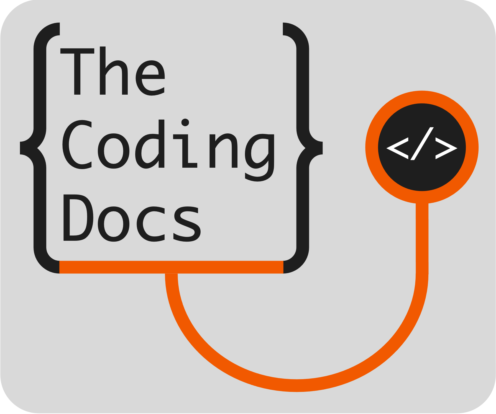

This is the source code for "Data Pipelines: Using a
Model-View-Controller Framework in R". It was written with **bookdown**.

## Links

-   Written with [bookdown](https://github.com/rstudio/bookdown "bookdown") R package
-   Strong influences from [golem]( https://thinkr-open.github.io/golem/  "golem") R package
-   REDCap https://projectredcap.org/about/
-   Model: [REDCap]( https://thinkr-open.github.io/golem/  "REDCap")
-   Controller: [R](https://cran.r-project.org/  "R")
-   View(s): [plotly](https://plotly.com/r/ "plotly") and MORE!
-   The Rosyverse package is at
    [github.com/brandonerose/Rosyverse](https://github.com/brandonerose/Rosyverse "Rosyverse R package")
    See instructions above. Install remotes and install RosyUtils
-   The RosyUtils package is at
    [github.com/brandonerose/RosyUtils](https://github.com/brandonerose/RosyUtils "RosyUtils R package")
-   Donate if I helped you out and want more development (anything
    helps)!
    [account.venmo.com/u/brandonerose](https://account.venmo.com/u/brandonerose "Venmo Donation")
-   For more R coding visit
    [thecodingdocs.com/](https://www.thecodingdocs.com/ "TheCodingDocs.com")
-   For correspondence/feedback/issues, please email
    [TheCodingDocs\@gmail.com](mailto:TheCodingDocs@gmail.com){.email}!
-   Follow us on Twitter
    [twitter.com/TheCodingDocs](https://twitter.com/TheCodingDocs "TheCodingDocs Twitter")
-   Follow me on Twitter
    [twitter.com/BRoseMDMPH](https://twitter.com/BRoseMDMPH "BRoseMDMPH Twitter")

